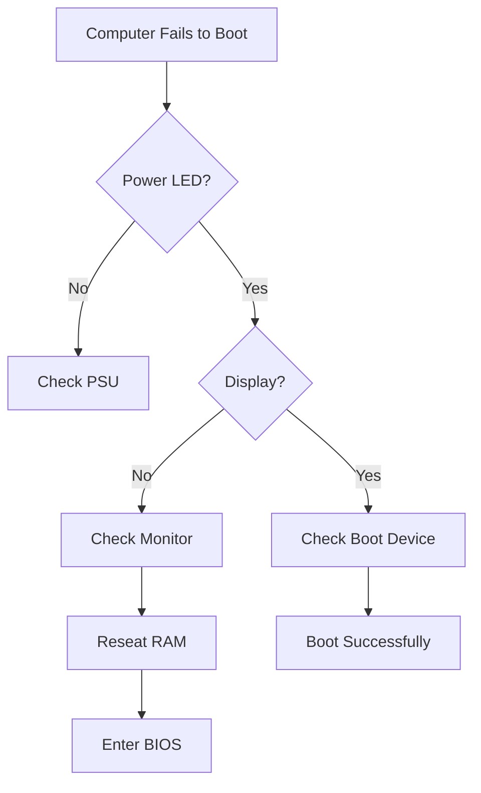

# Hardware Diagnostic Flow

```mermaid
flowchart TD

A[Computer Fails to Boot]

A --> B{Power LED?}

B -- No --> C[Check PSU]

B -- Yes --> D{Display?}

D -- No --> E[Check Monitor]

E --> F[Reseat RAM]

F --> G[Enter BIOS]

D -- Yes --> H[Check Boot Device]

H --> I[Boot Successfully]
```
