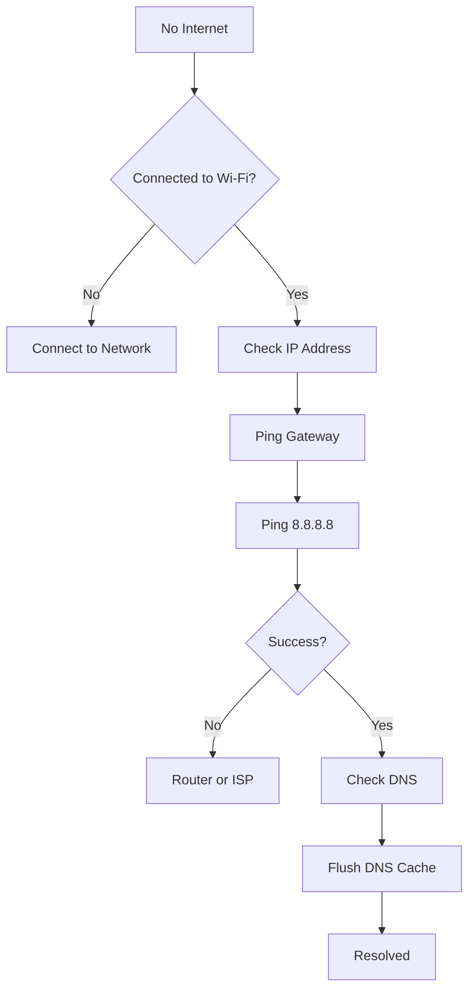

# Network Troubleshooting

```mermaid
flowchart TD

A[No Internet]

A --> B{Connected to Wi-Fi?}

B -- No --> C[Connect to Network]

B -- Yes --> D[Check IP Address]

D --> E[Ping Gateway]

E --> F[Ping 8.8.8.8]

F --> G{Success?}

G -- No --> H[Router or ISP]

G -- Yes --> I[Check DNS]

I --> J[Flush DNS Cache]

J --> K[Resolved]
```
