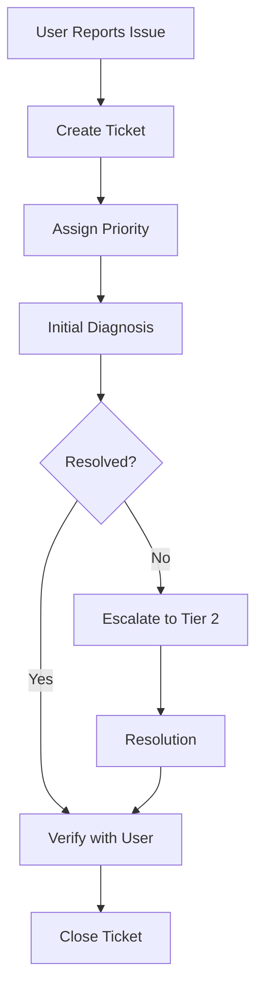

# Ticket Lifecycle

```mermaid
flowchart TD

A[User Reports Issue] --> B[Create Ticket]
B --> C[Assign Priority]
C --> D[Initial Diagnosis]
D --> E{Resolved?}

E -- Yes --> F[Verify with User]
F --> G[Close Ticket]

E -- No --> H[Escalate to Tier 2]
H --> I[Resolution]
I --> F
```
