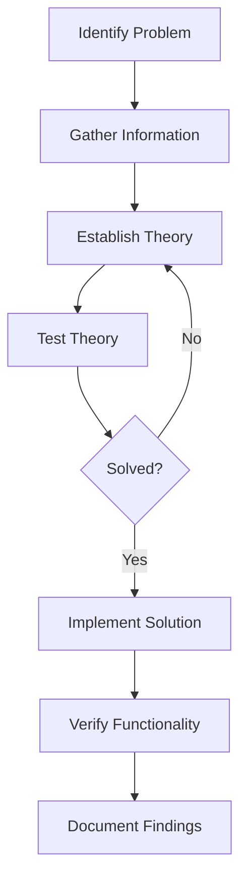

# Troubleshooting Methodology

```mermaid
flowchart TD

A[Identify Problem]
-->B[Gather Information]
-->C[Establish Theory]
-->D[Test Theory]
-->E{Solved?}

E -- No --> C

E -- Yes --> F[Implement Solution]
F --> G[Verify Functionality]
G --> H[Document Findings]
```
